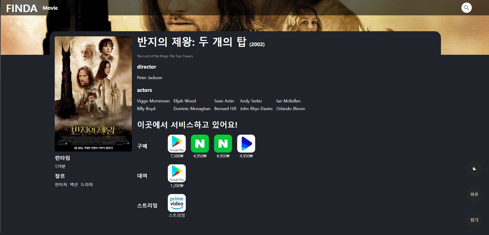
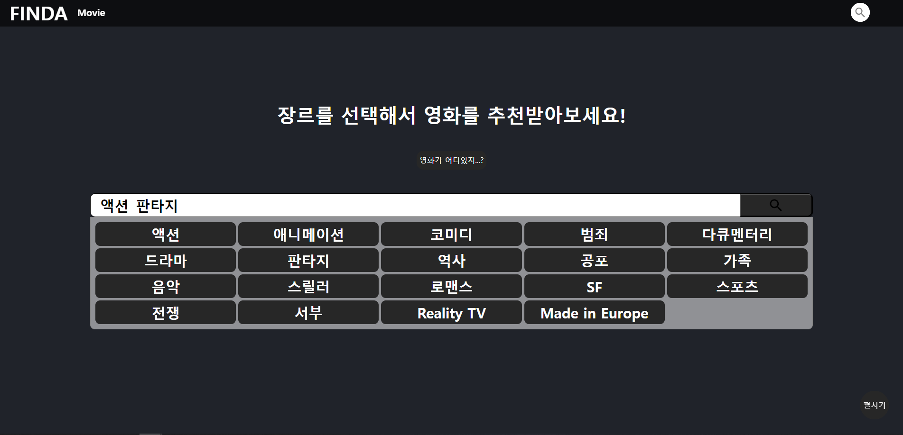
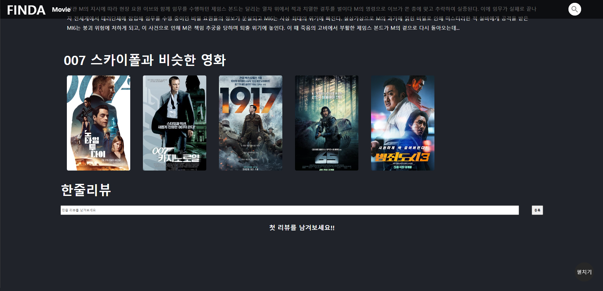

# [FINDA](https://finda-2.web.app/)와 함께 빠르게 영화를 찾아봐요!

 

영화를 어디서 봐야 찾아야 할지 모르겠나요?

FINDA는 **영화가 어디 있는지**,**비슷한 영화는 뭐가 있는지** 알려줘요!

### 영화가 어디에 있지?

 

 

### 영화 뭐보지?

 

 

### 비슷한 영화는 뭐가 있지?

 

 

 

# 프로젝트 개요

### Period

&emsp; **23.05.1 ~ 24.03.13**

&emsp; 유지보수,업데이트 중

&emsp; 

업데이트 내용

#### 23.3.28

- result 페이지 모바일 화면 여백 조절
- 썸네일 이미지, 설명글 추가
- 페이지 텝에 이미지,제목 변경
- 푸터 변경
- 화폐 단위 대신 역슬레시 나오는 문제 해결

#### 23.3.15

- 영화 페이지 로딩 에러 해결
- 포스터 길이 조절
- 비슷한 영화 스크롤바 삭제
- 라이트모드 색상 변경
  

  

### Link

&emsp; - [배포 사이트](https://finda-2.web.app/)

&emsp; - [개발 로그](https://www.notion.so/jjung5eung/finda-2-0-d6c564425f7c4ddab5611199ca949418?pvs=4)

### Member

🧑🏻‍💻 **[JS](https://github.com/herrakam)**

 

# 기술 스택

### FrontEnd

 
 

### Server,Infra

